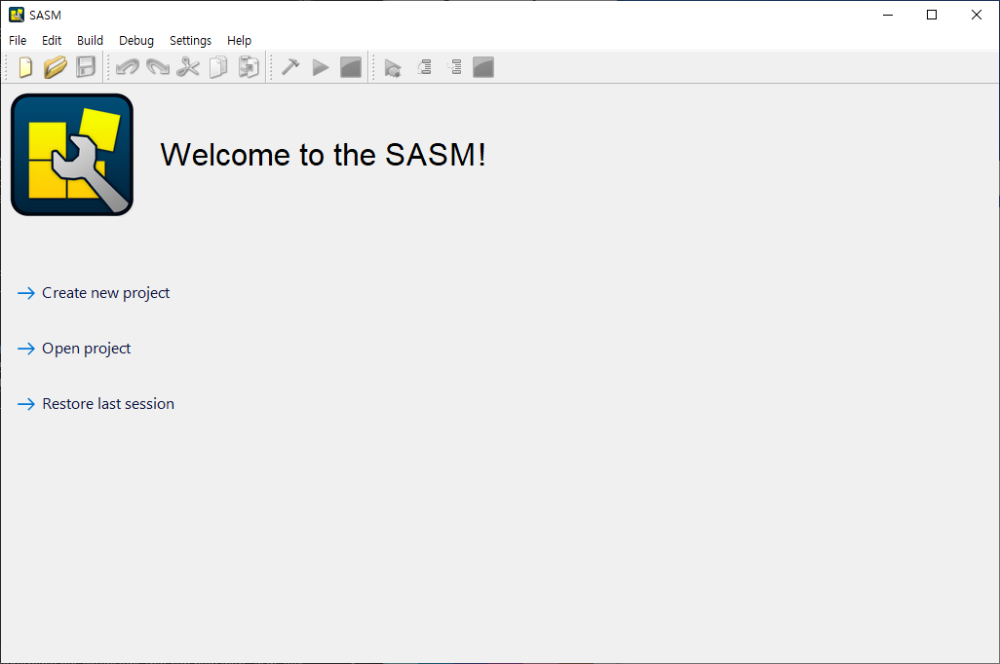
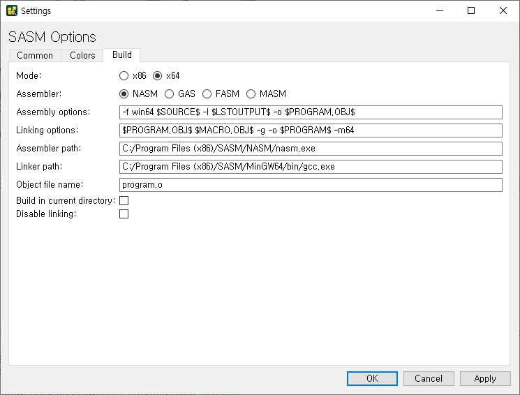

# SASM


    SASM: 어셈블러 개발 IDE이다. 어셈블리어는 NASM, GAS, FASM, MASM을 지원한다.

    설치 사이트: https://dman95.github.io/SASM/english.html


## NASM
    넷와이드 어셈블러는 인텔 x86 아키텍처용 어셈블러이자 역어셈블러이다.
    16비트, 32비트, 64비트 프로그램 작성에 사용할 수 있다. 
    NASM은 가장 대중적인 리눅스용 어셈블러들 가운데 하나로 인식된다.
    (위키백과)

## GAS
    GNU 어셈블러(GNU Assembler, 보통 gas 또는 간단히 as로 불리는)는 GNU 프로젝트에서 사용되는 어셈블러이다. 이것은 GCC의 기본 백엔드이며 GNU 운영 체제와 리눅스 커널 그리고 다양한 다른 소프트웨어를 어셈블하는데 사용된다. GNU 어셈블러는 GNU 바이너리 유틸리티의 한 부분이다.

## FASM
    FASM 는 x86 프로세서 용 어셈블러이다. 이것은 IA-32와 x86-64 컴퓨터 아키텍처 용 인텔 스타일 어셈블리어를 지원한다. FASM은 빠른 속도와 크기 최적화, 운영 체제 호환성 그리고 매크로 기능을 갖는다.

## MASM
    마이크로소프트 매크로 어셈블러(Microsoft Macro Assembler, MASM)는 인텔 문법을 사용하는 MS-DOS 및 마이크로소프트 윈도우용 x86 어셈블러이다. MASM 8.0을 기점으로 2가지 버전의 어셈블러가 있는데, 하나는 16비트 및 32비트 어셈블리 소스용이고 다른 하나(ML64)는 64비트 소스 전용이다.

    (출처: 위키백과)


# Hello World

    SASM을 실행시키면 다음과 같은 화면이 나온다.


    먼저 다음과 같이 사용 어셈블러를 NASM으로 설정하고, 64비트로 설정해준다.


    이후 화면에서 create new를 클릭하면

```
%include "io64.inc"

section .text
global CMAIN
CMAIN:
    ;write your code here
    xor rax, rax
    ret

```

    다음과 같이 나올 것이다.

    이후
[HelloWorld.asm](./HelloWorld.asm)
    다음과 같이 코딩을 한후 실행(f9)을 하면 Hello World가 출력되는 것을 볼 수 있다.