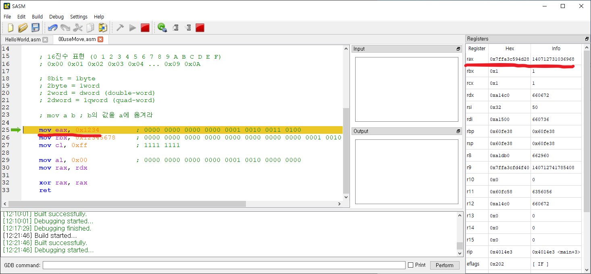
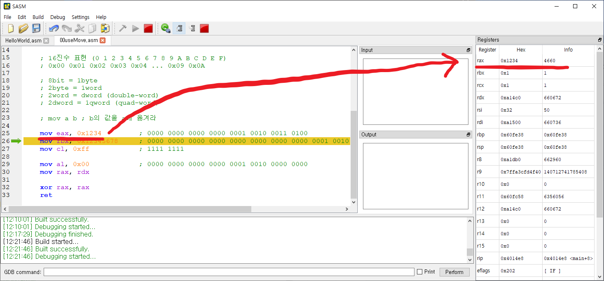
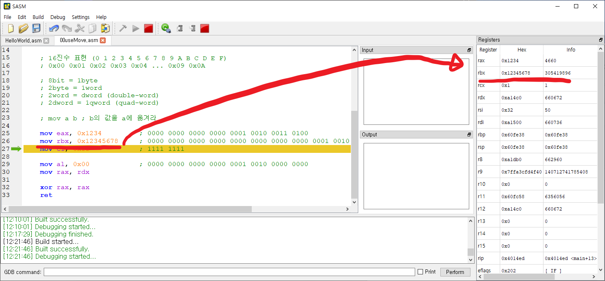
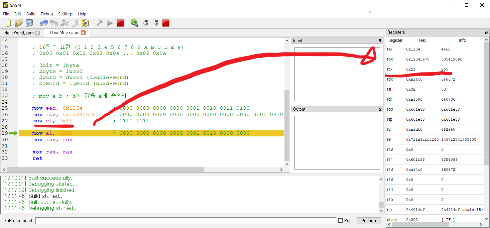
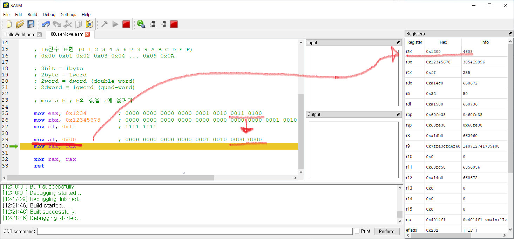
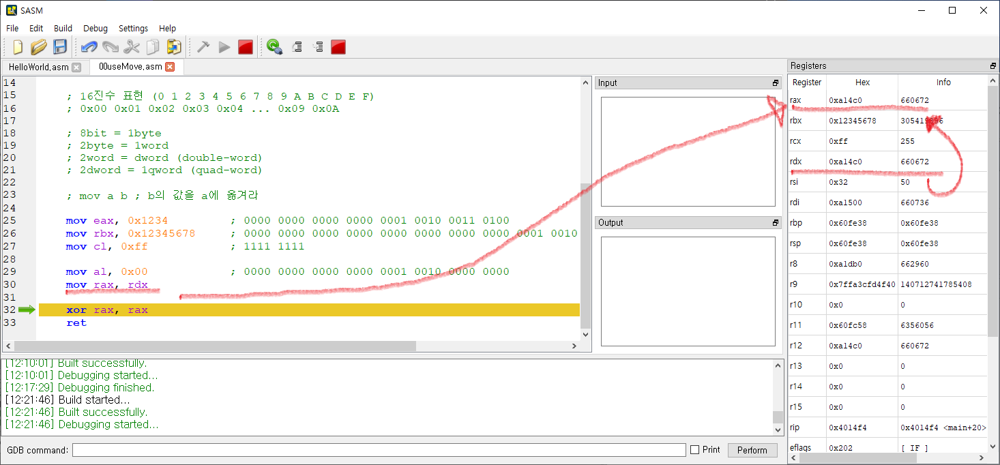

# 기초지식

    주석은 ;을 사용한다.

    주석은 ;를 사용하면 된다.
    
    10진수 표현 (0 1 2 3 4 5 6 7 8 9)
    0 1 2 3 4 ... 9 10
    
    2진수 표현 (0 1)
    0b0 0b1 0b10 0b11 0b110 ... 0b1001 0b1010
    
    16진수 표현 (0 1 2 3 4 5 6 7 8 9 A B C D E F)
    0x00 0x01 0x02 0x03 0x04 ... 0x09 0x0A
    
    8bit = 1byte
    2byte = 1word
    2word = dword (double-word)
    2dword = 1qword (quad-word)

# 레지스터 기초

    어셈블리에서 사용하는 레지스터의 크기에 따라 명칭이 다르다.

    사용량  명칭  범위
    64bit   rax  0 ~ 63
    32bit   eax  0 ~ 31
    16bit   ax   0 ~ 15
     8bit   ah   8 ~ 15
     8bit   al   0 ~  7

# 예제 코드

(코드)[./code/00useMove.asm]

