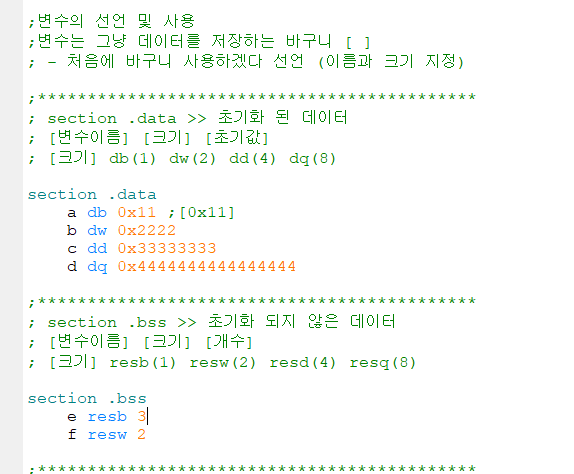
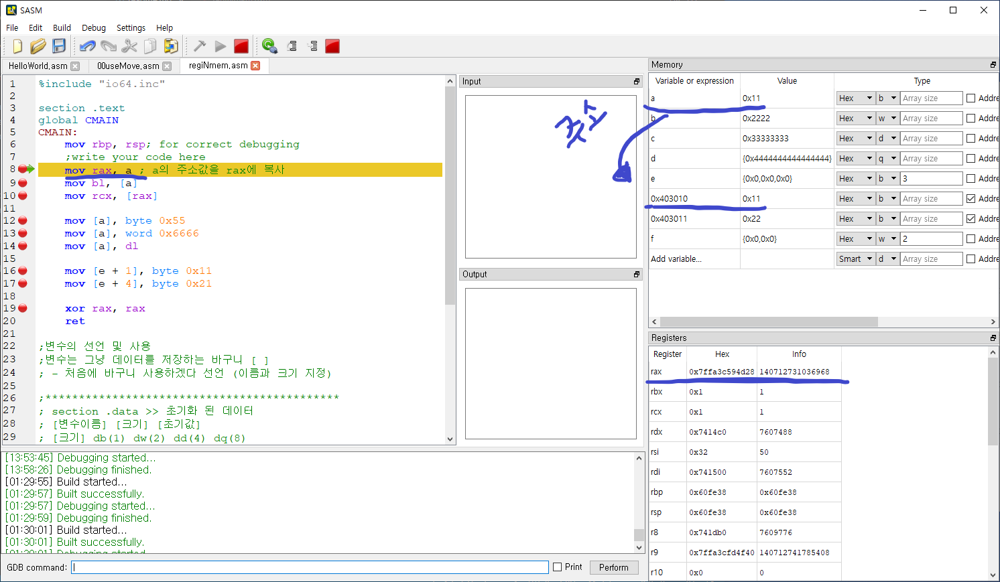
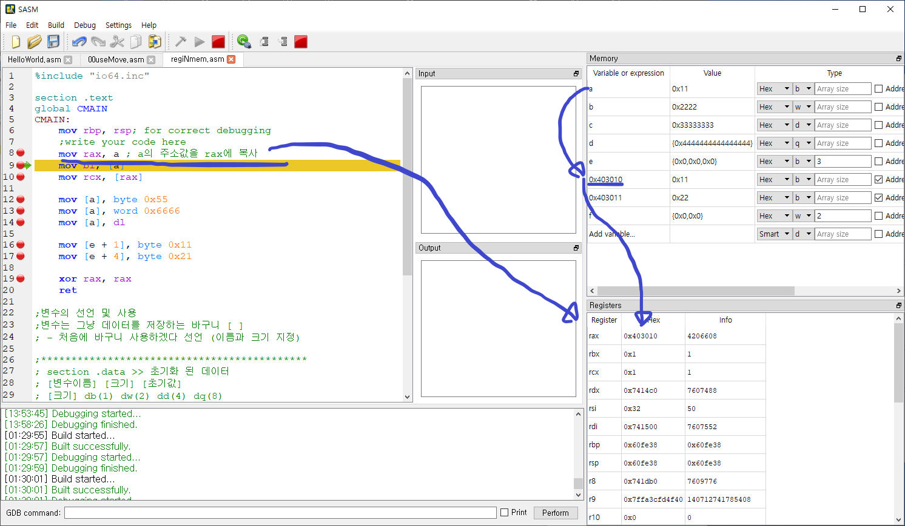
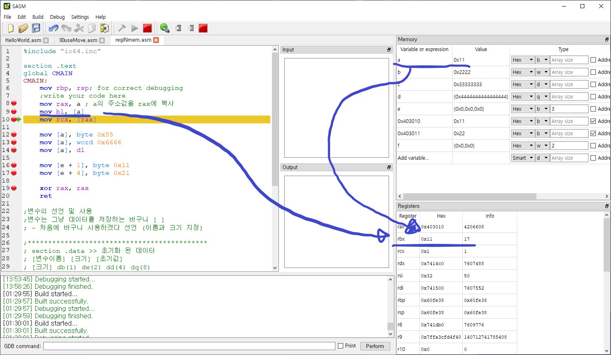
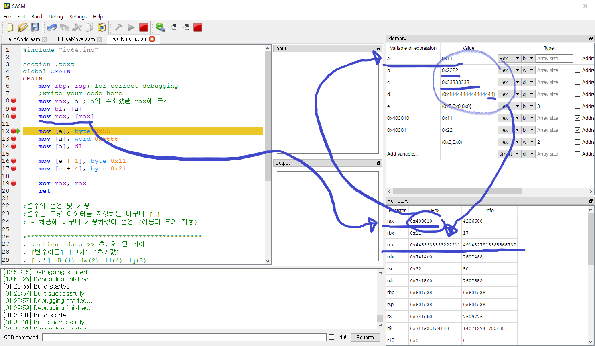
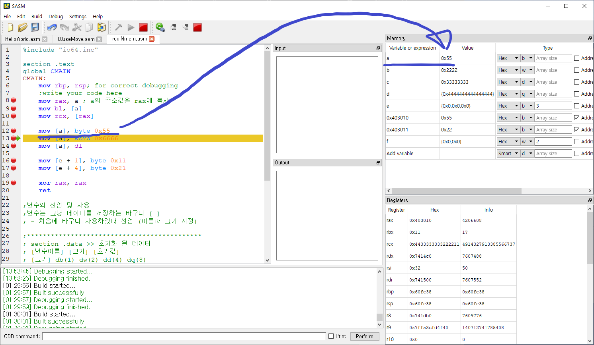
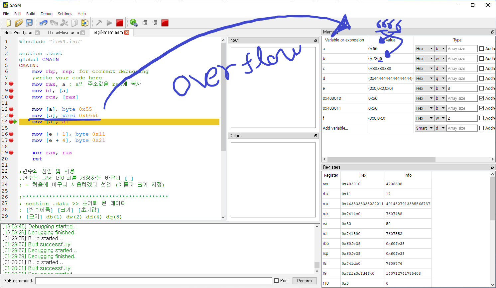
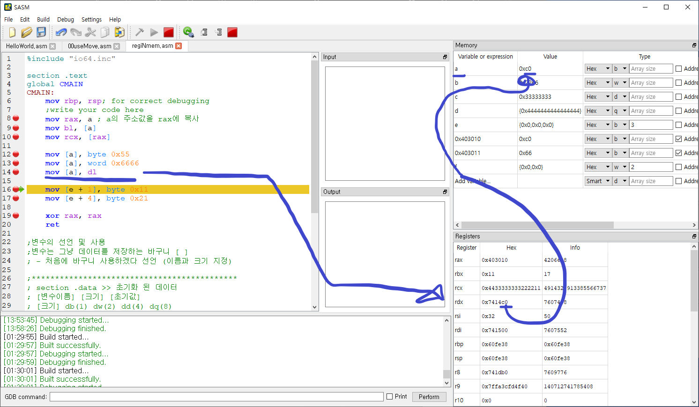
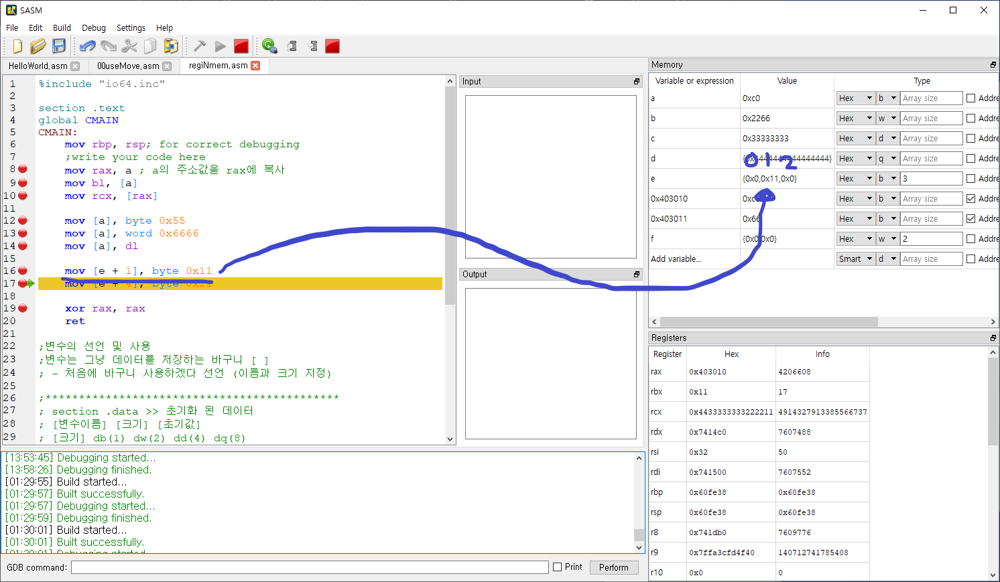
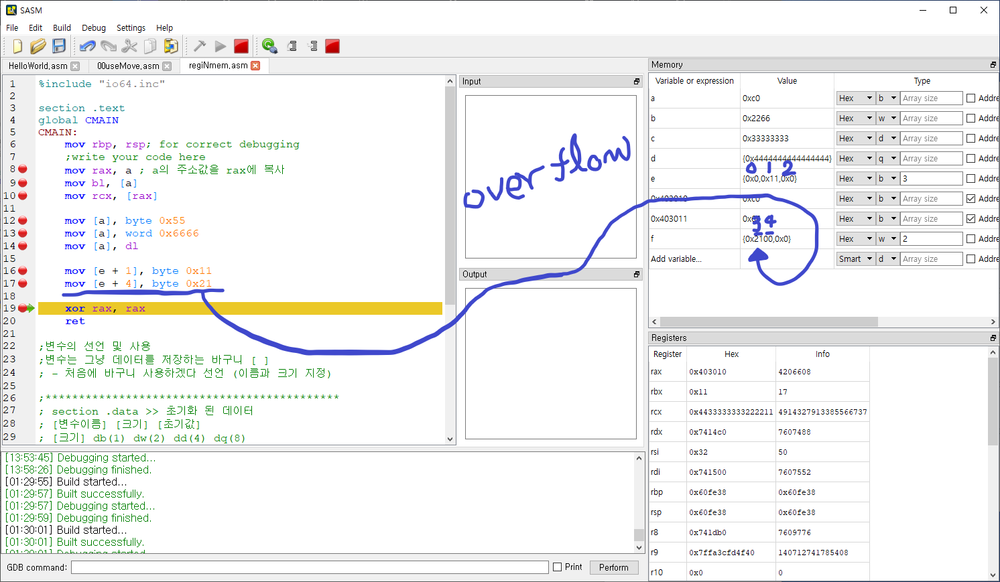

# 레지스터와 메모리

    section .data >> 초기화 된 데이터
    [변수이름] [크기] [초기값]
    [크기] db(1) dw(2) dd(4) dq(8)

    section .bss >> 초기화 되지 않은 데이터
    [변수이름] [크기] [개수]
    [크기] resb(1) resw(2) resd(4) resq(8)

[예제](./code/regiNmem.asm)

### 변수 입력

### 초기 값들

### 단순 변수 이름은 a 는 그 값을 주는 것이 아닌 주소값을 받는것을 알 수 있다.

### a의 값을 받고싶으면 [ ] 대괄호를 써야된다.

### a의 주소에 [] 안에 직간접적으로 써도 접근가능하다.

### 다음과 같은 방법으로 메모리에 저장된 변수에 접근가능하다.

### 다음과 같은경우 오버플로우가 발생하여 변수 b의 값도 변경된다.

### 변수에서 레지스터와는 반대로 레지스터의 값을 변수로 가져갈 수도 있다.

### 다음과 같은 배열의 경우 그림과 같이 접근가능하다.

### 배열크기보다 크게 오버플로우 발생시켰을 때의 모습이다.

