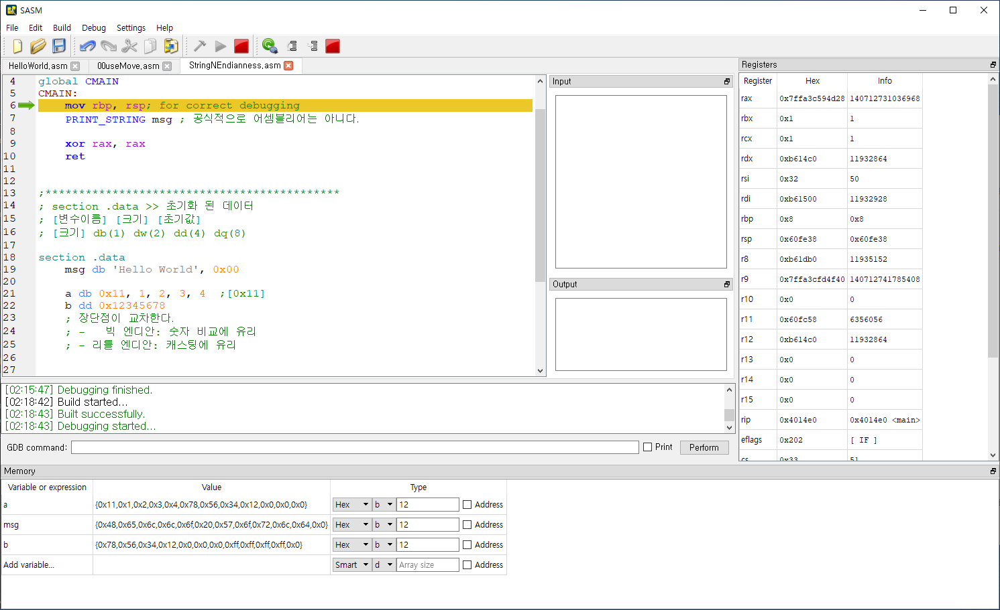

# 문자와 엔디안


## 문자

    변수는 한 번에 여러 개 지정할 수 있다.
```
; 예시
section .data
    a db 0x11, 1, 2, 3, 4  
```
    
    Hello World 코드에서

```
section .data
    msg db 'Hello World', 0x00
```
    이것을 보았을 것 이다.

    이를 디버그를 통하여 보면



    0x48,0x65,0x6c,0x6c,0x6f,0x20,0x57,0x6f,0x72,0x6c,0x64,0x0

    이 값들을 아스키로 변환하면
    0x48,0x65,0x6c,0x6c,0x6f,0x20,0x57,0x6f,0x72,0x6c,0x64,0x0
    H   ,e   ,l   ,l   ,o   ,    ,W   ,o   ,r   ,l   ,d   ,NULL
    이다.
    
    즉 '' 을 쓰면 내부의 값은 아스키 값을 기준으로 하나씩 저장된다는 것을 알 수 있다.
    그리고 배열의 끝을 알리는 값으로써 0x00 (NULL)을 해주는 것을 잊지 말자.

## 엔디안 Endian

    그리고 변수 b를 byte 단위로 끊어서 보면
    0x12345678 저장 방식이
    
    0x12 0x34 0x56 0x78 
    이 아니라
    
    0x78 0x56 0x34 0x12 으로 저장된 것을 볼 수 있다.

    이는 저장 방식으로 리틀 엔디안을 사용하기 때문이다.


    (출처: https://genesis8.tistory.com/37)

    위 내용은 차후 통신을 통하여 다른 컴퓨터와 데이터를 주고 받을 때 중요해진다.
    간혹 통신하는 컴퓨터 끼리 엔디안 방식이 서로 다른 경우가 발생하면
    대처를 안 했을 시 치명적인 문제가 발생할 것 이다.
    (0x1234를 0x3412 로 읽는 경우 등) 따라서 이러한 것이 있는 것 정도는 알아두자.
