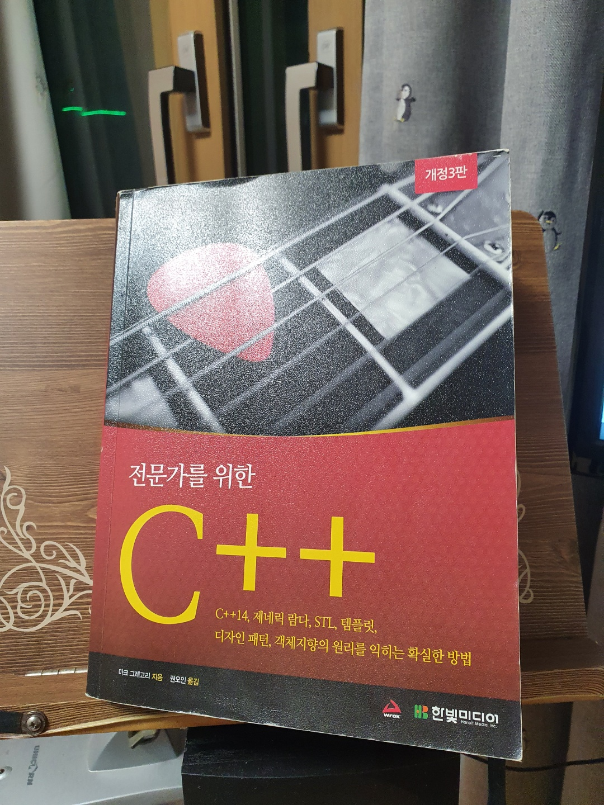

# 전문가를 위한 C++ 책보며 따라하기

## 00. 이 프로젝트를 시작하며...

    어느덧 4학년 여름방학이다.
    무엇을 하면 좋을까 고민하다가 마침 군대에서 있었던 것이 떠올랐다.
    당시 막 해병 훈단 수료후 후반기교육을 받을 때 였다.
    후반기로 정보보안병에 지원하여 거기서 만난 후반기 동기들 중 한명이 현역에서 뛰시다가 온 사람이였다.
    그양반이 거의 예찬하다 싶이 하던 언어가 있었는데 바로 C++이었고, 
    그에 감명받은 나는 무슨 책으로 공부하면 될까 물어보았었다.
    그리하여 샀던 책이 페이지 수만 1200장이 넘는 전문가를 위한 C++

    
    책값이 아깝게 구석에 박혀있었지만 그러나!
    오늘부터 꾸준히 책을 보면서 공부한 내용을 업로드 하고자 한다.

## 01. Chapter1 C++와 STL 부딫혀보기
[01로 이동](./Chapter01)

